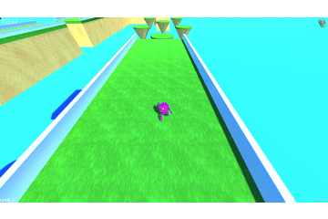

## About Runner

<a href="https://poolofclay33.github.io/ShatterRepo/">Download Runner</a>
  
**Project description:** I've been working on Shatter for the past couple of weeks. My main goal was to create a simple 
cube runner-like game at the core, but add other mechanics for the player to use within a very vibrant environment. 
The game is still a work in progress but the first six levels are playable as well as the gravity level. 

### In-Game Video 

### Screenshots

