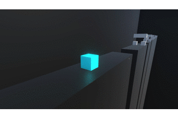

## About Shatter

<a href="https://poolofclay33.github.io/ShatterRepo/">Download Shatter</a>
  
**Project description:** I've been working on Shatter for the past couple of weeks. My main goal was to create a simple cube runner-like game at the core, but add other mechanics for the player to use within a very vibrant environment. The game is still a work in progress but the first six levels are playable as well as the gravity level. 

### 3. In-Game Video 

### 4. Provide a basis for further data collection through surveys or experiments

Sed ut perspiciatis unde omnis iste natus error sit voluptatem accusantium doloremque laudantium, totam rem aperiam, eaque ipsa quae ab illo inventore veritatis et quasi architecto beatae vitae dicta sunt explicabo. 

For more details see [GitHub Flavored Markdown](https://guides.github.com/features/mastering-markdown/).
